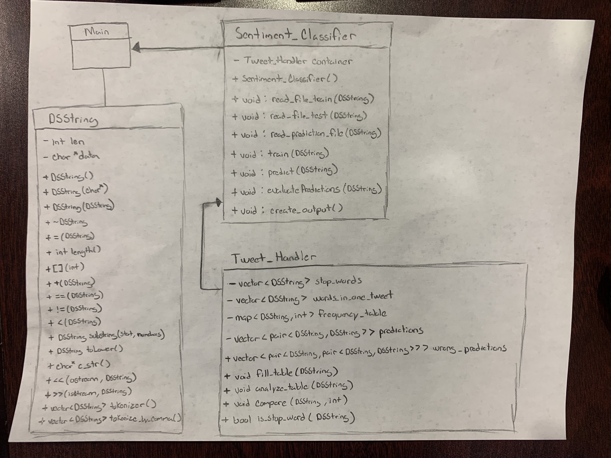

# Assignment 2: Answers

**Complete this document, commit your changes to Github and submit the repository URL to Canvas.** Keep your answers short and precise.

Your Name: Nino Castellano

Used free extension: [ ] 24 hrs or [ ] 48 hrs

[x] Early submission (48 hrs)

[X] Bonus work. Describe: Increased accuracy using stop words

Place [x] for what applies.

## UML Diagram

Add your UML class diagram here.

Replace the following image with your diagram. You can draw it by hand and take a photo.

## Answers

1. How do you train the model and how do you classify a new tweet? Give a short description of the main steps.

    > So in my Sentiment Classifier class I have a train function that works with my read train_file function that basically is used to fill my frequency table or map with the tokenized words and its sentiment frequency ((-int) negative word, (+int) positive word).

2. How long did your code take for training and what is the time complexity of your training implementation (Big-Oh notation)? Remember that training includes reading the tweets, breaking it into words, counting, ... Explain why you get this complexity (e.g., what does `N` stand for and how do your data structures/algorithms affect the complexity).

   > My training process first starts off with the initial call to the train function. In terms of Big-Oh my train function is of O(n*m) where n is the number of tweets and m is the words in the tweets. I search by each tweet the words and see if they are in the map, if not then I add them to it. The training phase took approximately 1.45 seconds.

3. How long did your code take for classification and what is the time complexity of your classification implementation (Big-Oh notation)? Explain why.

   > My prediction or classification process is essentially the same as my training in Big-Oh of O(n*m) where I have the number of tweets and m as the words in the tweets but this time I am just searching through the map making my predictions. The classification took approximately 0.28 seconds.

4. How do you know that you use proper memory management? I.e., how do you know that you do not have
   a memory leak?

   > I made sure that in my DSString class I had a destructor and looked to delete any data on the heap anytime the new keyword was used in other constructors. I also ran the program through valgrind.

5. What was the most challenging part of the assignment?

   > I feel the most challenging part of this project was the planning of how I would go about making the frequency table and then using it to make my predictions. Planning out what classes I would possibly be using was challenging as I didn't even up implementing some of the classes I had come up with originally.